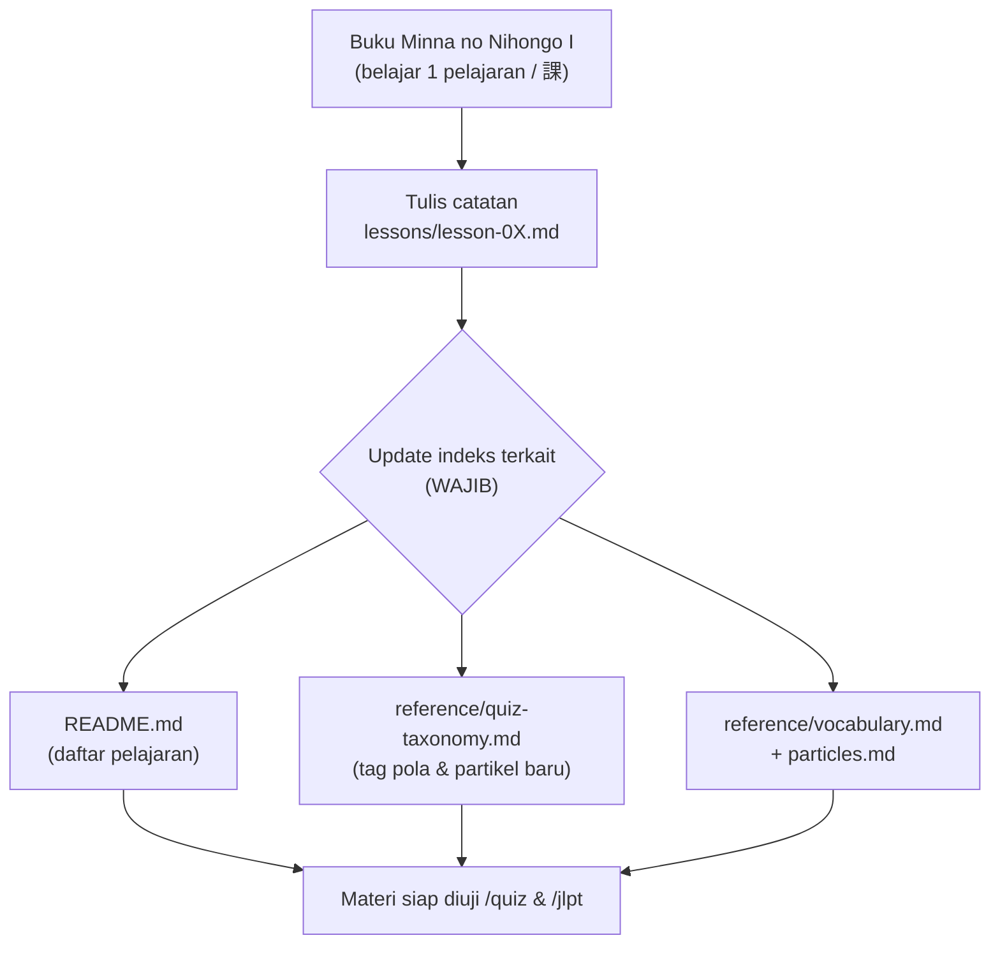
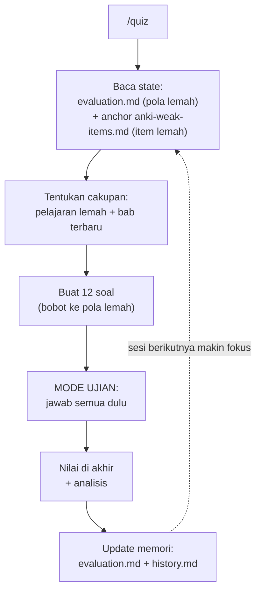
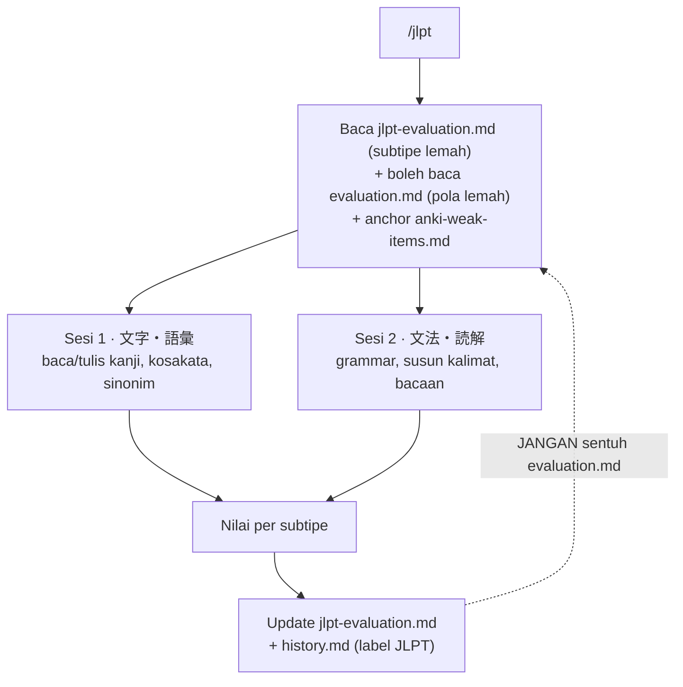
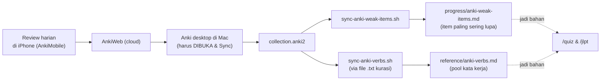
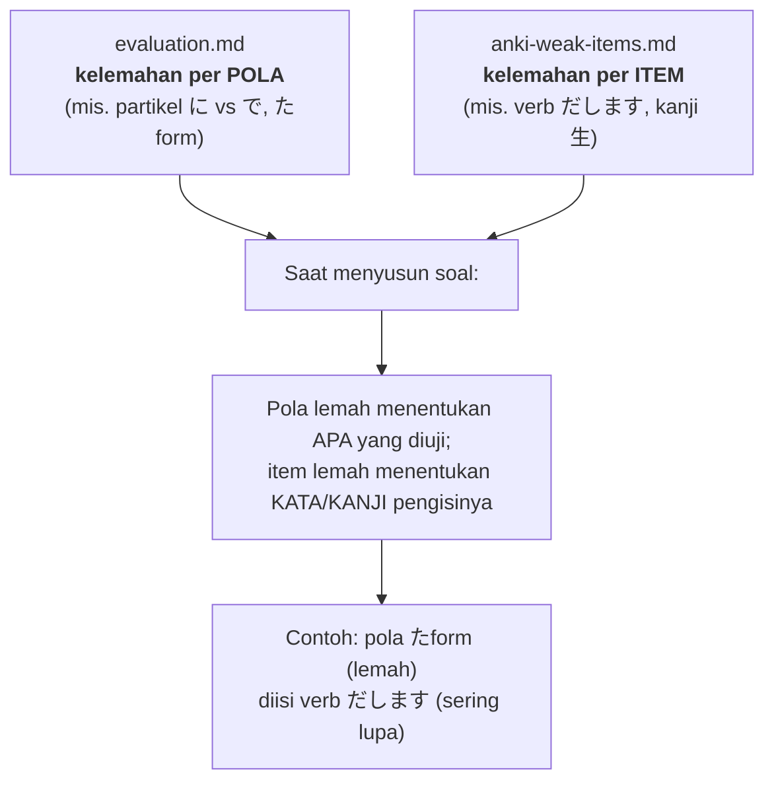

# Cara Kerja Knowledge Base — Flow & Logika Bisnis

> Penjelasan **untuk manusia**: bagaimana KB ini bekerja dari ujung ke ujung. Diagram
> pakai Mermaid (otomatis ter-render di Obsidian). Detail teknis tetap di CLAUDE.md &
> `.claude/skills/*/SKILL.md`; dokumen ini peta besarnya.

## Ringkasan satu paragraf

KB ini punya **satu tujuan**: bantu belajar Minna no Nihongo I menuju JLPT N5, dengan
**active recall** (mengingat aktif) yang **adaptif** ke titik lemah. Alurnya: kamu catat
materi tiap pelajaran → sistem menyimpannya sebagai "source of truth" → tiap hari kamu
latihan lewat `/quiz` (atau mock `/jlpt`) → hasil latihan **dicatat balik** sebagai peta
kelemahan → sesi berikutnya **otomatis condong** ke yang lemah. Anki (aplikasi hafalan
terpisah) menyumbang **sinyal item yang sering kamu lupa** untuk mempertajam pilihan soal.

## Tujuan (Goals)

**Tujuan akhir (outcome) — kenapa KB ini ada:**
- 🎯 **Kuasai materi Minna no Nihongo I** (tata bahasa, kosakata, kanji dasar).
- 🎯 **Lulus JLPT N5** — target ujian resmi.

**Tujuan fungsional — apa yang KB lakukan untuk mencapainya:**
1. **Arsip materi yang rapi & bisa dibaca ulang** — catatan per pelajaran (課) sebagai
   "source of truth", nyaman dibaca di Obsidian (penjelasan Bahasa Indonesia, contoh
   kalimat Bahasa Jepang).
2. **Latihan active recall yang adaptif** — `/quiz` harian yang menargetkan titik lemah,
   bukan soal acak; `/jlpt` untuk simulasi ujian tertulis.
3. **Evaluasi kelemahan yang jujur & berkelanjutan** — peta kelemahan diperbarui tiap
   sesi supaya latihan berikutnya makin terarah.

**Prinsip yang menjaga tujuan (design goals):**
- **Akurat** — soal hanya dari materi yang benar-benar sudah dicatat (`lessons/`).
- **Jujur** — skor dihitung eksplisit, tidak dikarang.
- **Utuh** — materi tidak dibuang saat diedit; tiap perubahan dilaporkan.
- **Efisien** — hemat token (baca anchor), supaya latihan cepat & murah.
- **Fokus** — Jepang (N5) prioritas utama; proyek lain dibuat lebih ringan.

## Peta komponen (siapa memegang apa)

| Lapisan | File / folder | Peran |
|--------|---------------|-------|
| **Sumber kebenaran** | `lessons/lesson-0X.md` | Tata bahasa yang SUDAH dipelajari — acuan mutlak semua soal |
| **Kolam materi** | `reference/n5-vocabulary.md`, `n5-synonyms.md`, `anki-verbs.md`, `particles.md`, `quiz-taxonomy.md` | Pool kosakata, sinonim, kata kerja, partikel, & daftar tag pola |
| **Sumber skor** | `progress/attempts.jsonl`, `baseline.json` | Kebenaran skor (JSONL append-only) — dari sini tracker `.md` di-generate |
| **Memori kemajuan** | `progress/evaluation.md`, `jlpt-evaluation.md`, `history.md` (AUTO-GENERATED) + `anki-weak-items.md` | Peta kelemahan + riwayat sesi — **view** yang ditulis engine |
| **Mesin pembukuan** | `scripts/kb.py` (+ `test_kb.py`) | Engine deterministik: hitung skor/status/ranking, `render`/`record` tracker, `plan` seleksi cakupan |
| **Mesin latihan** | `.claude/skills/quiz/`, `.claude/skills/jlpt/` | Logika membuat, menilai, & mengadaptasi soal (pembukuan didelegasikan ke `kb.py`) |
| **Aturan main** | `CLAUDE.md` | Hub konteks + prinsip yang selalu berlaku |
| **Jembatan Anki** | `scripts/sync-anki-*.sh` | Tarik data dari deck/collection Anki → file KB |
| **Pintu refresh Anki** | `.claude/skills/sync-anki/` | Command `/sync-anki` — bungkus kedua script + notif hasil |

## Engine vs model — siapa mengerjakan apa (per flow)

Pemisahan tegas: **engine `scripts/kb.py` = semua yang deterministik** (hitung, banding,
ranking, seleksi, render); **model = yang butuh judgment bahasa** (bikin soal, tetapkan
kunci, prosa). Perintah engine: `import`/`render`/`record`(`--dry-run`)/`plan`/`summary`.

| Flow · sub-langkah | ⚙️ Engine | 🧠 Model |
|---|:---:|:---:|
| `/quiz` · seleksi cakupan + bobot + acak posisi | `plan` | |
| `/quiz` · **generate soal + tetapkan `key`** | | ✅ |
| `/quiz` · **grade** (`submitted == key`) | `record` (`grade()`) | |
| `/quiz` · **override** soal rancu | | ✅ (`override`+`note`) |
| `/quiz` · skor/akurasi/status/ranking + tulis tabel + history | `record` | |
| `/quiz` · prosa `weak_narrative`/`history_note` (angka dari `--dry-run`) | | ✅ |
| `/jlpt` · seleksi + grade + pembukuan (tracker terpisah, `kind=jlpt`) | `plan`+`record` | |
| `/jlpt` · generate soal + kunci + teks bacaan | | ✅ |
| `/summary` · breakdown per dim + 3 terlemah + skor terakhir | `summary` | |
| `/summary` · sajian furigana + rekomendasi | | ✅ |
| `/sync-anki` · regen `anki-verbs.md` / `anki-weak-items.md` | `sync-anki-*.sh`¹ | |
| semua · sisip furigana, pembahasan | | ✅ |

¹ `/sync-anki` deterministik tapi lewat **script bash tersendiri**, bukan `kb.py` (domain
beda: parsing Anki). Detail engine pembukuan: `docs/engine-bookkeeping-plan.md`.

## Alur 1 — Mencatat materi (input / "ingest")



**Inti:** menambah 1 pelajaran bukan sekadar menulis 1 file — ada "bookkeeping" wajib
(indeks, tag, kosakata) supaya mesin latihan bisa menemukannya. Konvensi **anchor**
(judul + Topik + "Ringkasan cepat") di tiap lesson membuat pembacaan hemat token.

## Alur 2 — Latihan harian `/quiz` (loop adaptif = jantung sistem)



**Langkah dinilah "logika bisnis" utamanya** — sebuah lingkaran umpan balik:
1. **Baca kelemahan** yang tercatat.
2. **Buat soal** yang menekankan kelemahan itu (≥40% dari weak area).
3. **Uji** (jawab semua → koreksi di akhir; preferensi tetap).
4. **Catat hasil** → peta kelemahan diperbarui (skor dihitung eksplisit, tak dikarang).
5. **Ulangi** → tiap sesi otomatis menyesuaikan.

## Alur 3 — Mock ujian `/jlpt` (varian, jalur terpisah)



**Bedanya dengan `/quiz`:** meniru struktur **ujian tertulis** N5 (2 sesi), pakai
tracker **terpisah** (`jlpt-evaluation.md`), dan boleh **membaca** peta pola `/quiz`
untuk membiaskan soal grammar, tapi **tidak menulisnya**. Fitur *hint fading*: bantuan di
opsi dipudarkan seiring penguasaan.

## Alur 4 — Sinyal Anki (pendukung, mempertajam pilihan)



**Catatan penting:** `collection.anki2` hanya sesegar **sync terakhir Anki desktop**.
Review dari iPhone harus ditarik dulu dengan **membuka app desktop & Sync** sebelum
`sync-anki-weak-items.sh` dijalankan.

**Satu pintu — `/sync-anki`:** daripada memanggil dua script manual, command `/sync-anki`
membungkus keduanya: mengingatkan prasyarat Sync desktop, menjalankan script terkait
(`/sync-anki` = keduanya · `weak` / `verbs` = salah satu), lalu memberi **notifikasi**
— `✅ Sukses updated` + ringkasan bila ada data baru, atau `ℹ️ No data updated` bila tak
berubah. Detail: `.claude/skills/sync-anki/SKILL.md`.

## Logika inti: DUA sinyal kelemahan yang dinikahkan

Ini pembeda utama KB ini. Ada dua jenis "lemah" yang dilacak dari sudut berbeda:



- **`evaluation.md`** menjawab: *pola/tata bahasa apa yang masih goyah?*
- **`anki-weak-items.md`** menjawab: *kata/kanji apa yang paling sering aku lupa?*
- **Digabung:** soal menguji **pola lemah**, memakai **item lemah** sebagai "kendaraan".
  Anki = pemilih *kosakata*, **bukan** pengganti *pola* (biasnya lunak & tunduk).
- **Fallback (penting):** kalau **tak ada item 🔴 yang cocok** dengan pola/cakupan yang
  sedang diuji, pakai **kosakata lain** dari `n5-vocabulary.md` / `anki-verbs.md` — jangan
  paksakan item lemah masuk kalau bikin soal janggal. Pola tetap yang utama; Anki hanya bias.

## Engine adaptif — cara skor, status & pembobotan dihitung

Ini "mesin" di balik loop adaptif (Alur 2). Semua angka **dihitung eksplisit**, tak
dikarang. Berlaku sama untuk `/quiz` (menulis `evaluation.md`) & `/jlpt` (menulis
`jlpt-evaluation.md`).

### 1. Status kelemahan (ambang)
Tiap **tag** (pola / partikel / lesson / subtipe JLPT) menyimpan `Benar` & `Total`
kumulatif lintas sesi. Dari situ:

```
Akurasi = round(Benar / Total × 100)%
```

| Akurasi | Status | Arti |
|---------|:------:|------|
| < 60% | 🔴 LEMAH | prioritas utama soal berikutnya |
| 60–79% | 🟡 | menengah, masih diperkuat |
| ≥ 80% | 🟢 | dikuasai |
| `Total < 3` | ⚪ | **belum cukup data** — status ditahan sampai ≥3 attempt |

### 2. Update tiap akhir sesi
Untuk **tiap tag** yang muncul di sesi ini:

```
Total_baru = Total_lama + jumlah soal bertag itu
Benar_baru = Benar_lama + jumlah soal benar bertag itu
Akurasi    = round(Benar_baru / Total_baru × 100)%
```

Lalu daftar **Weak areas** disusun ulang: tag 🔴 dulu, kemudian 🟡, diurut dari
**akurasi terendah** (maks ~5). Baris `_(kosong)_` dihapus begitu ada data nyata.
Satu baris ditambahkan ke `history.md` (entri terbaru di atas).

### 3. Pembobotan & cakupan soal berikutnya
- **Cakupan default** (`/quiz` polos) = **pelajaran lemah + bab terbaru**, dibatasi
  **maks ~3 lesson** (prioritas akurasi terendah) demi hemat token — bukan semua lesson.
- **Maintenance (0 weak-area):** kalau semua pola 🟢/⚪, `plan` beralih ke **spaced review** —
  3 bab **paling lama tak diuji** (lawan decay), `"maintenance":true`; sebar merata tanpa bobot.
- **Sadar-taxonomy:** `plan` hanya menyodorkan **bab quizzable** (punya tag di
  `quiz-taxonomy.md`); bab tanpa tag tak dipilih. → detail B2/B3 `engine-bookkeeping-plan.md`.
- **Bobot adaptif:** ≥**40%** soal diambil dari weak area bila ada; sisanya sebar merata.
  Mode `review` → hampir semua soal dari tag 🔴/🟡. Sesi pertama (belum ada data) →
  sebar merata ke seluruh pola in-scope.
- **Bias kendaraan Anki** → lihat bagian "DUA sinyal" di atas (lunak + fallback).
- **Rotasi permukaan (`/quiz`):** kendaraan verb/kosakata tak boleh monoton antar-sesi —
  `plan --kind quiz` memberi `avoid_vehicles` (item 2 sesi quiz terakhir dari field
  `vehicles` di `attempts.jsonl`), skill condongkan ke kendaraan lain. **Yang berputar cuma
  baju soal, BUKAN pola** — pola lemah tetap diulang (spaced repetition). Bias LUNAK;
  prioritas: kecocokan pola > item 🔴 Anki > `avoid_vehicles`.
- **Rotasi tema teks (`/jlpt`):** cerita `DK-dokkai`/`joho`/`bunshou` tak boleh monoton —
  `plan --kind jlpt` memberi `avoid_themes` (tema mock terakhir dari `attempts.jsonl`),
  skill memilih tema beda & menyimpan `themes` sesi ini (B4).
- **Rotasi item non-teks (`/jlpt`):** `plan --kind jlpt` juga memberi `avoid_items` (dict
  per-subtipe item 2 mock terakhir dari `attempts.jsonl`) untuk enam subtipe non-teks —
  `MG-yomi`/`MG-hyouki` & `MG-bunmyaku`/`MG-ruigi` (identitas `key`), `DK-bunpou`/`DK-narabekae`
  (identitas pola id di `tags`). Skill pilih item BEDA per subtipe (bias LUNAK; weak-area menang).

### 4. Aturan penyajian (menjaga recall tetap jujur)
- **Mode ujian:** jawab **semua** soal dulu, koreksi & analisis muncul **di akhir**.
- **Posisi jawaban benar diacak** & disebar merata (1/2/3/4) lintas soal — **jangan**
  taruh kunci di nomor 1 terus (kalau selalu sama, user menebak dari pola, bukan paham).
- **Semua kanji berfurigana** — soal, tabel hasil, ringkasan, & panel AskUserQuestion.
- **Hint fading (`/jlpt`):** bantuan di `description` opsi **dipudarkan bertahap**
  mengikuti penguasaan subtipe (🔴/🟡/⚪ → hint penuh; menuju 🟢 → netral; mantap 🟢 →
  tanpa hint) — scaffolding, bukan dicabut mendadak.

### 5. Pemisahan tracker `/quiz` vs `/jlpt`
- `/quiz` **hanya** menulis `evaluation.md` (+ `history.md`).
- `/jlpt` **hanya** menulis `jlpt-evaluation.md` (+ `history.md` berlabel `JLPT`); boleh
  **membaca** `evaluation.md` untuk membiaskan grammar, tapi **tak pernah menulisnya**.

## Aturan main (governance) yang selalu berlaku

- **Source of truth tata bahasa = `lessons/`.** Soal tak boleh menguji pola di luar yang
  sudah dicatat.
- **Semua kanji wajib berfurigana** (soal, tabel hasil, ringkasan, panel).
- **Posisi jawaban benar diacak** (1/2/3/4), jangan nomor 1 terus — `/quiz` & `/jlpt`.
- **Hemat token:** baca **anchor**, bukan file utuh; detail dibaca on-demand.
- **File turunan** (`anki-verbs.md`, `anki-weak-items.md`) **AUTO-GENERATED** — jangan
  diedit tangan; regen lewat script.
- **Jangan mengarang skor** — hitung eksplisit dari angka lama + hasil sesi.
- **Konsistensi diperiksa ad-hoc** saat perlu (bukan skill `/lint` formal) — lihat
  `docs/anki-integration-plan.md` §3.

## Glosarium singkat

| Istilah | Arti |
|---------|------|
| **Active recall** | Mengingat aktif (memproduksi jawaban), bukan sekadar membaca ulang |
| **Anchor** | Bagian ringkas di atas file (~20 baris) yang cukup dibaca tanpa buka seluruh file |
| **Kendaraan (vehicle)** | Kata/kanji yang dipakai untuk mengisi soal sebuah pola |
| **File turunan** | File yang di-generate dari sumber lain; tak diedit manual |
| **lapses / leech** | Berapa kali kartu Anki gagal / penanda kartu bermasalah kronis |
| **Weak area** | Pola/subtipe/item berstatus 🔴 (lemah) atau 🟡 (menengah) |

---
_Peta besar; untuk aturan operasional lengkap lihat `CLAUDE.md` dan `.claude/skills/`._
