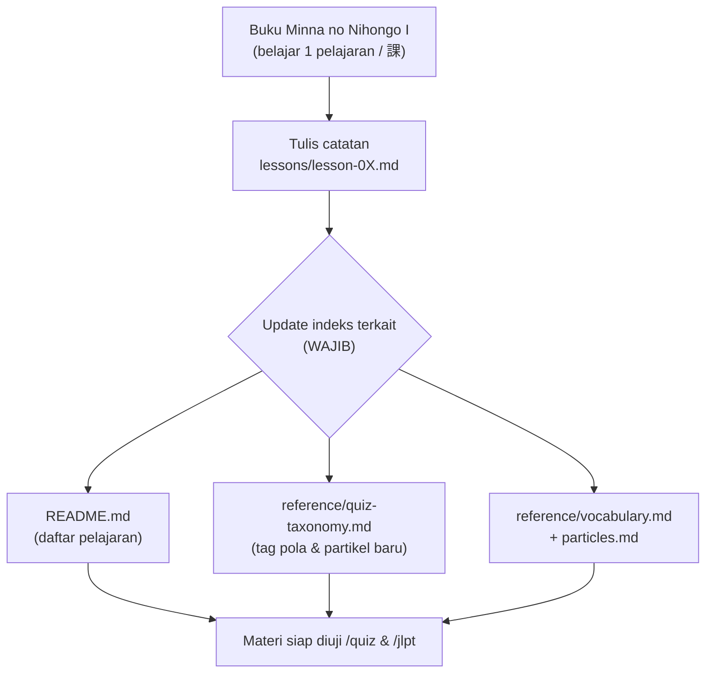
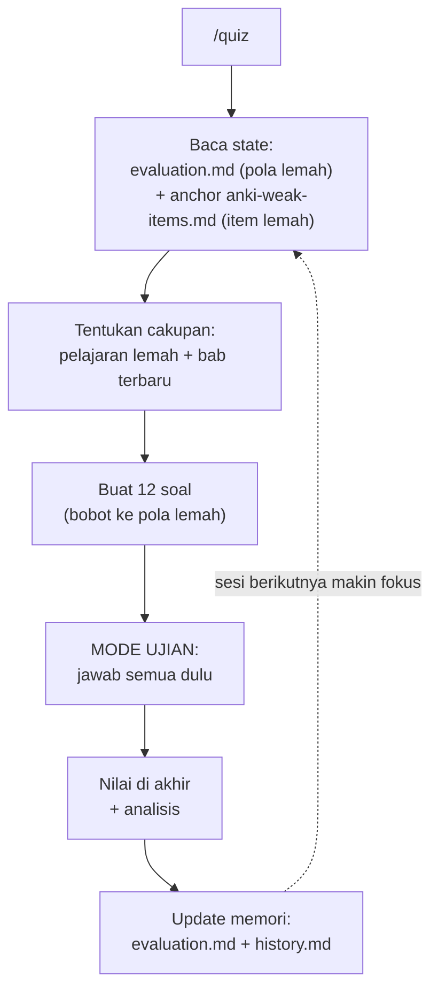
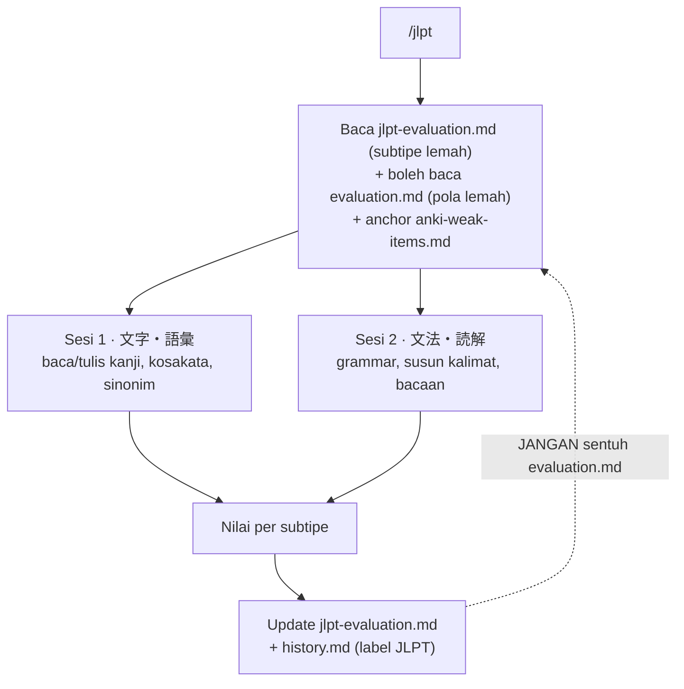
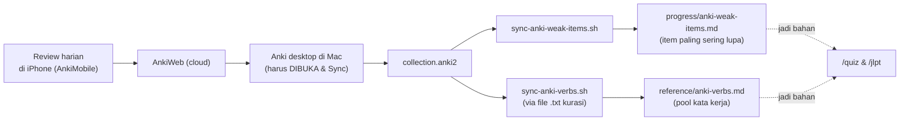
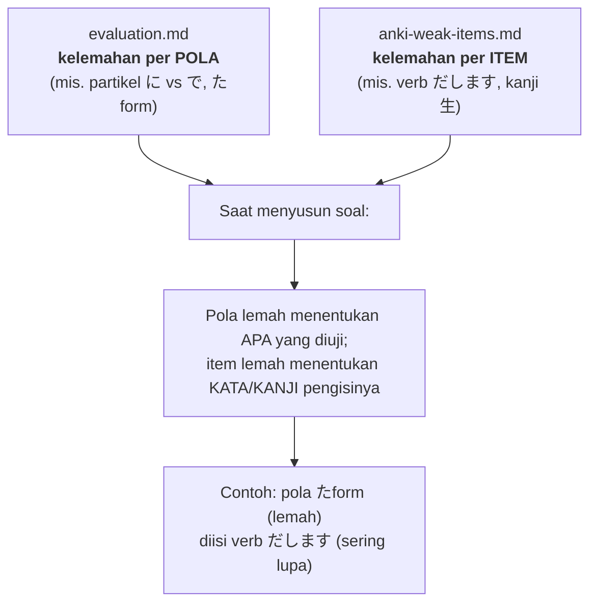

# Cara Kerja Knowledge Base — Flow & Logika Bisnis

> Penjelasan **untuk manusia**: bagaimana KB ini bekerja dari ujung ke ujung. Diagram
> pakai Mermaid (otomatis ter-render di Obsidian). Detail teknis tetap di CLAUDE.md &
> `.claude/skills/*/SKILL.md`; dokumen ini peta besarnya.

## Ringkasan satu paragraf

KB ini punya **satu tujuan**: bantu belajar Minna no Nihongo I menuju JLPT N5, dengan
**active recall** (mengingat aktif) yang **adaptif** ke titik lemah. Alurnya: kamu catat
materi tiap pelajaran → sistem menyimpannya sebagai "source of truth" → tiap hari kamu
latihan lewat `/quiz` (atau mock `/jlpt`) → hasil latihan **dicatat balik** sebagai peta
kelemahan → sesi berikutnya **otomatis condong** ke yang lemah. Anki (aplikasi hafalan
terpisah) menyumbang **sinyal item yang sering kamu lupa** untuk mempertajam pilihan soal.

## Tujuan (Goals)

**Tujuan akhir (outcome) — kenapa KB ini ada:**
- 🎯 **Kuasai materi Minna no Nihongo I** (tata bahasa, kosakata, kanji dasar).
- 🎯 **Lulus JLPT N5** — target ujian resmi.

**Tujuan fungsional — apa yang KB lakukan untuk mencapainya:**
1. **Arsip materi yang rapi & bisa dibaca ulang** — catatan per pelajaran (課) sebagai
   "source of truth", nyaman dibaca di Obsidian (penjelasan Bahasa Indonesia, contoh
   kalimat Bahasa Jepang).
2. **Latihan active recall yang adaptif** — `/quiz` harian yang menargetkan titik lemah,
   bukan soal acak; `/jlpt` untuk simulasi ujian tertulis.
3. **Evaluasi kelemahan yang jujur & berkelanjutan** — peta kelemahan diperbarui tiap
   sesi supaya latihan berikutnya makin terarah.

**Prinsip yang menjaga tujuan (design goals):**
- **Akurat** — soal hanya dari materi yang benar-benar sudah dicatat (`lessons/`).
- **Jujur** — skor dihitung eksplisit, tidak dikarang.
- **Utuh** — materi tidak dibuang saat diedit; tiap perubahan dilaporkan.
- **Efisien** — hemat token (baca anchor), supaya latihan cepat & murah.
- **Fokus** — Jepang (N5) prioritas utama; proyek lain dibuat lebih ringan.

## Peta komponen (siapa memegang apa)

| Lapisan | File / folder | Peran |
|--------|---------------|-------|
| **Sumber kebenaran** | `lessons/lesson-0X.md` | Tata bahasa yang SUDAH dipelajari — acuan mutlak semua soal |
| **Kolam materi** | `reference/n5-vocabulary.md`, `n5-synonyms.md`, `anki-verbs.md`, `particles.md`, `quiz-taxonomy.md` | Pool kosakata, sinonim, kata kerja, partikel, & daftar tag pola |
| **Memori kemajuan** | `progress/evaluation.md`, `jlpt-evaluation.md`, `anki-weak-items.md`, `history.md` | Peta kelemahan (per pola & per item) + riwayat sesi |
| **Mesin latihan** | `.claude/skills/quiz/`, `.claude/skills/jlpt/` | Logika membuat, menilai, & mengadaptasi soal |
| **Aturan main** | `CLAUDE.md` | Hub konteks + prinsip yang selalu berlaku |
| **Jembatan Anki** | `scripts/sync-anki-*.sh` | Tarik data dari deck/collection Anki → file KB |

## Alur 1 — Mencatat materi (input / "ingest")

**Inti:** menambah 1 pelajaran bukan sekadar menulis 1 file — ada "bookkeeping" wajib
(indeks, tag, kosakata) supaya mesin latihan bisa menemukannya. Konvensi **anchor**
(judul + Topik + "Ringkasan cepat") di tiap lesson membuat pembacaan hemat token.

## Alur 2 — Latihan harian `/quiz` (loop adaptif = jantung sistem)

**Langkah dinilah "logika bisnis" utamanya** — sebuah lingkaran umpan balik:
1. **Baca kelemahan** yang tercatat.
2. **Buat soal** yang menekankan kelemahan itu (≥40% dari weak area).
3. **Uji** (jawab semua → koreksi di akhir; preferensi tetap).
4. **Catat hasil** → peta kelemahan diperbarui (skor dihitung eksplisit, tak dikarang).
5. **Ulangi** → tiap sesi otomatis menyesuaikan.

## Alur 3 — Mock ujian `/jlpt` (varian, jalur terpisah)

**Bedanya dengan `/quiz`:** meniru struktur **ujian tertulis** N5 (2 sesi), pakai
tracker **terpisah** (`jlpt-evaluation.md`), dan boleh **membaca** peta pola `/quiz`
untuk membiaskan soal grammar, tapi **tidak menulisnya**. Fitur *hint fading*: bantuan di
opsi dipudarkan seiring penguasaan.

## Alur 4 — Sinyal Anki (pendukung, mempertajam pilihan)

**Catatan penting:** `collection.anki2` hanya sesegar **sync terakhir Anki desktop**.
Review dari iPhone harus ditarik dulu dengan **membuka app desktop & Sync** sebelum
`sync-anki-weak-items.sh` dijalankan.

## Logika inti: DUA sinyal kelemahan yang dinikahkan

Ini pembeda utama KB ini. Ada dua jenis "lemah" yang dilacak dari sudut berbeda:

- **`evaluation.md`** menjawab: *pola/tata bahasa apa yang masih goyah?*
- **`anki-weak-items.md`** menjawab: *kata/kanji apa yang paling sering aku lupa?*
- **Digabung:** soal menguji **pola lemah**, memakai **item lemah** sebagai "kendaraan".
  Anki = pemilih *kosakata*, **bukan** pengganti *pola* (biasnya lunak & tunduk).

## Aturan main (governance) yang selalu berlaku

- **Source of truth tata bahasa = `lessons/`.** Soal tak boleh menguji pola di luar yang
  sudah dicatat.
- **Semua kanji wajib berfurigana** (soal, tabel hasil, ringkasan, panel).
- **Hemat token:** baca **anchor**, bukan file utuh; detail dibaca on-demand.
- **File turunan** (`anki-verbs.md`, `anki-weak-items.md`) **AUTO-GENERATED** — jangan
  diedit tangan; regen lewat script.
- **Jangan mengarang skor** — hitung eksplisit dari angka lama + hasil sesi.
- **Konsistensi diperiksa ad-hoc** saat perlu (bukan skill `/lint` formal) — lihat
  `docs/anki-integration-plan.md` §3.

## Glosarium singkat

| Istilah | Arti |
|---------|------|
| **Active recall** | Mengingat aktif (memproduksi jawaban), bukan sekadar membaca ulang |
| **Anchor** | Bagian ringkas di atas file (~20 baris) yang cukup dibaca tanpa buka seluruh file |
| **Kendaraan (vehicle)** | Kata/kanji yang dipakai untuk mengisi soal sebuah pola |
| **File turunan** | File yang di-generate dari sumber lain; tak diedit manual |
| **lapses / leech** | Berapa kali kartu Anki gagal / penanda kartu bermasalah kronis |
| **Weak area** | Pola/subtipe/item berstatus 🔴 (lemah) atau 🟡 (menengah) |

---
_Peta besar; untuk aturan operasional lengkap lihat `CLAUDE.md` dan `.claude/skills/`._
